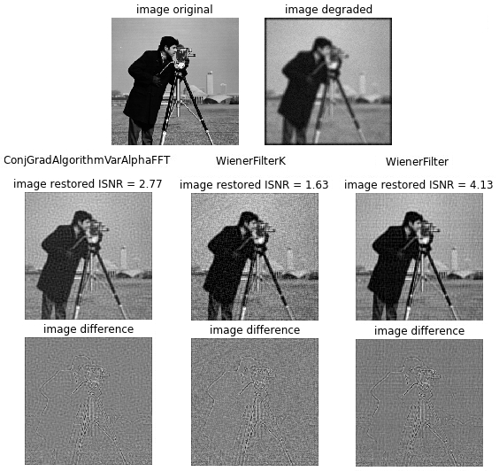

'''
demo_image_restoration.py

This demo shows how to solve the image restoration problem

Assumptions:

    (1) Degradation process can be modeled by a linear and shift-invariant system;
    
    (2) Degradation operator (convolution kernel) is known.
    
Possibilities:

    Image restoration in the image domain (domain = 'image'). Slow restoration with high RAM requirements:
        (1) Constrained least squares filter (Clsfilter);
        
        (2) Spatially adaptive constrained least squares filter (SpatiallyAdaptiveClsFilter);
        
        (3) Iterative constrained least squares filter (IterClsFilter) with the following optimization algorithms:
            
            (a) gradient algorithm with variable step size (method = 'GradAlgorithmVarAlpha');
            (b) gradient algorithm with manual step size (method = 'GradAlgorithmManualAlpha');
            (c) gradient algorithm with linesearch (method = 'GradAlgorithmLinesearch');
            
            (d) conjugate gradient algorithm with variable step size (method = 'ConjGradAlgorithmVarAlpha');
            (e) conjugate gradient algorithm with manual step size (method = 'ConjGradAlgorithmManualAlpha');
            (f) conjugate gradient algorithm with linesearch (method = 'ConjGradAlgorithmLinesearch');
            
            (g) newton algorithm (method = 'NewtonAlgorithm');
            (h) newton algorithm with linesearch (method = 'NewtonAlgorithmLinesearch');
            
            (l) quasi newton algorithm (method = 'QuasiNewtonAlgorithm');
            (j) quasi newton algorithm with linesearch (method = 'QuasiNewtonAlgorithmLinesearch');

    Image restoration in the frequency domain (domain = 'fft'). Fast restoration:       
        (1) Constrained least squares filter (Clsfilter);
        
        (2) Iterative constrained least squares filter (IterClsFilter) with the following optimization algorithms:
            
            (a) gradient algorithm with variable step size (method = 'GradAlgorithmVarAlphaFFT');
            (b) gradient algorithm with manual step size (method = 'GradAlgorithmManualAlphaFFT');
            (c) gradient algorithm with linesearch (method = 'GradAlgorithmLinesearchFFT');
            
            (d) conjugate gradient algorithm with variable step size (method = 'ConjGradAlgorithmVarAlphaFFT');
            (e) conjugate gradient algorithm with manual step size (method = 'ConjGradAlgorithmManualAlphaFFT');
            (f) conjugate gradient algorithm with linesearch (method = 'ConjGradAlgorithmLinesearchFFT');
            
            (g) newton algorithm (method = 'NewtonAlgorithmFFT');
            (h) newton algorithm with linesearch (method = 'NewtonAlgorithmLinesearchFFT');     
        
        (3) Wiener filter (WienerFilter) with known noise and known nondegraded image
        
        (4) Wiener filter (WienerFilterK) with unknown noise and unknown nondegraded image

'''        

**Dummy dataset** 

Added Gaussian noise, mean 0, std dev 5 
Image restoration in the frequency domain:  
(left) Conjugate gradient filter, (center) Wiener filter with an empirical K constant, (right) Wiener filter

  

